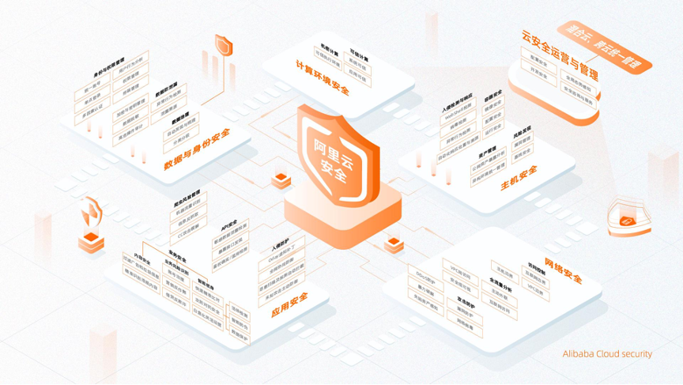
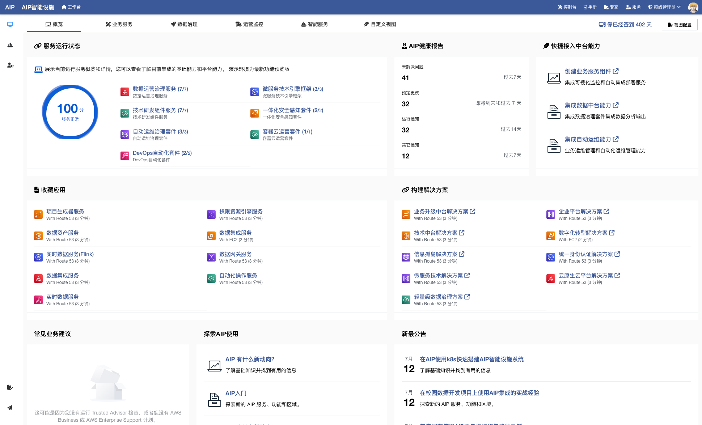
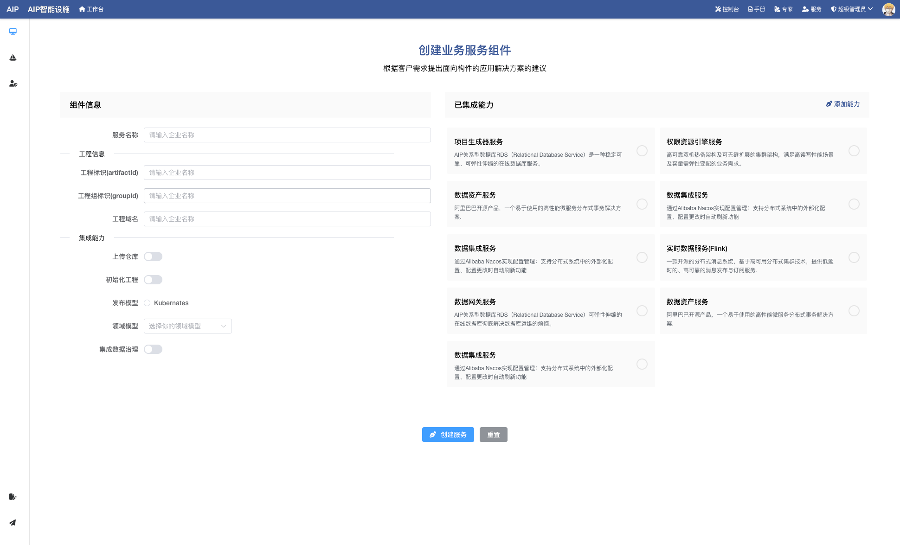
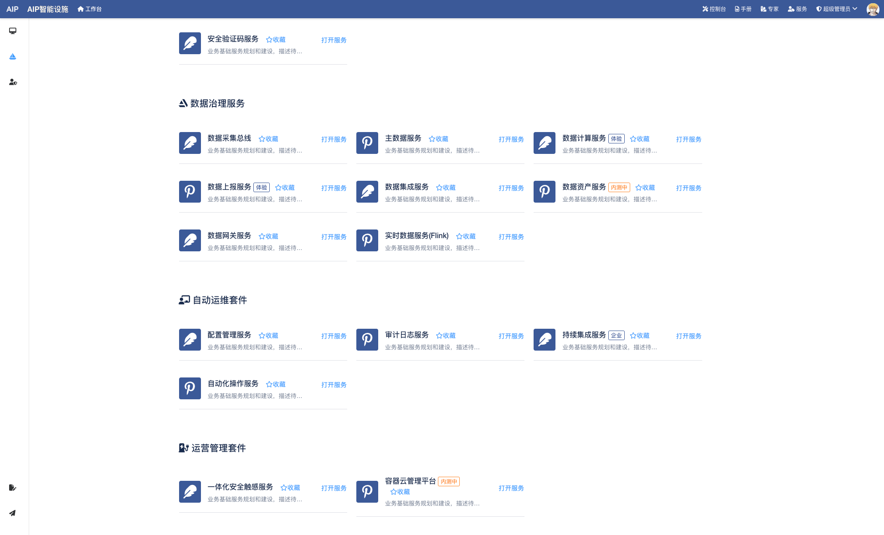
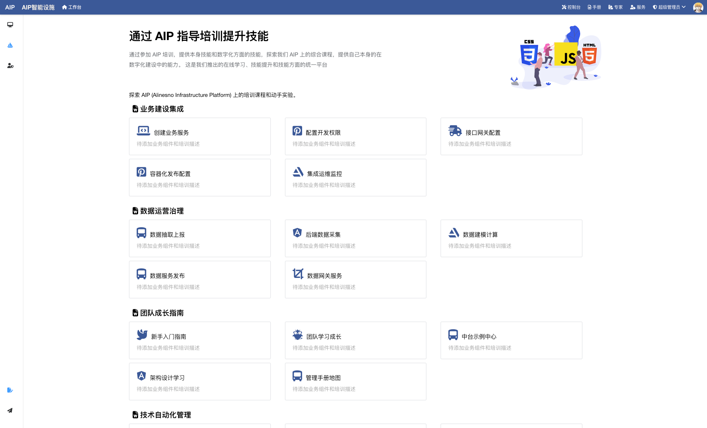
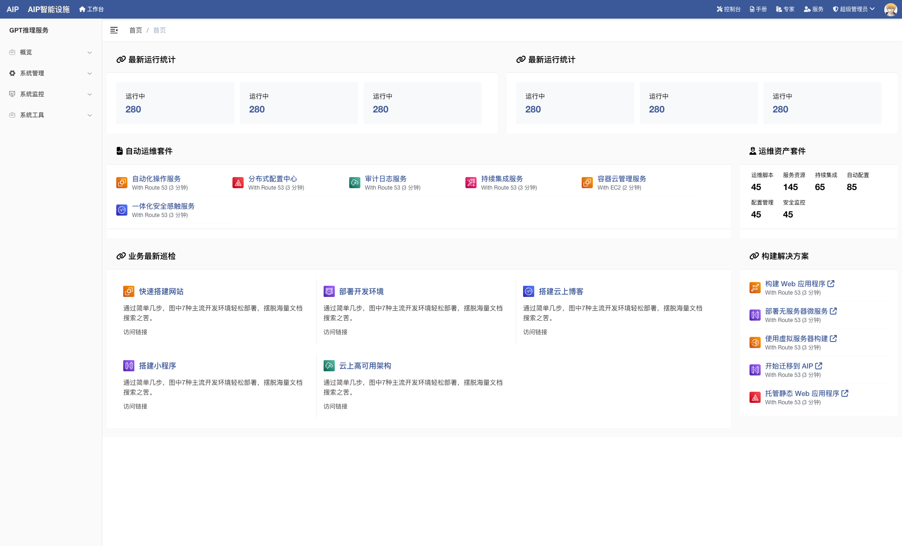

# AIP智能设施

> 本基线主要为了学习交流学习使用，部分图片为网上获取，如有侵权，请说明

软件新智能设施（以下简称新基设)，全称alinesno-infrastructure-platform（简称AIP)，通过建设软件新智能设施和平台，推动业务自动化转型和创新的发展，提高竞争力、降低成本、支持创新和业务拓展，以及提升团队协作效率

## 什么叫新智能设施

软件新智能设施是指针对现代软件开发和运行需求而建设的智能设施系统，包括开发工具、测试环境、运行平台和协作工具等。

它以技术创新和信息网络为基础，旨在支持软件行业的数字转型、智能升级和融合创新。软件新智能设施的建设涉及多个领域，包括云计算、基设架构、容器化、持续集成和部署、大数据处理、人工智能等。

通过提供高效、可靠、安全的软件开发和运行环境，软件新智能设施能够提高软件质量、简化维护、支持创新和提升团队协作效率。它为软件行业的发展提供了重要的支撑和推动作用，促进了超级自动化时代的软件创新和应用发展。

## 类似产品

> 这里我们假设项目针对具体单一项目，团队业务指的是企业平台或者团队平台。

AIP是针对于项目和团队业务建设的基础设施平台，为了更好的理解AIP，与市场上类似的产品做为参考：

- 阿里云：针对于IaaS和PaaS的平台
- 金蝶云苍穹：针对于项目的平台
- CDH: 针对于大数据的平台
- DingTalk: 针对于OA的平台

上面的平台都是提供出对应的平台给上层业务能力，更好的为业务服务，AIP的产品定位也是类似，只不过AIP针对的是项目和团队业务建设的平台。

比如问题场景示例：

假设针对于项目场景，一般项目开始需要做技术选型还有项目的组件规划，会拼凑各种开源组件，形成项目基础，在过程中想到哪些就做哪些，大部分是依赖高级工程师经验，
但是要考虑完整的项目比如文档、规范、安全、备份、运维、数据治理等非功能性需求会很多，如果维护多个项目，成本会倍增。

假设针对团队业务场景，一般需要技术和业务架构师做好规划，然后搭建平台，内部培训，再开展对应的试点工作，不断的改进内部业务平台，比如电商平台，仅仅需要
搭建底层的架构和平台，可能消耗时间半年或者一年，同时还有失败的风险，在时间和可行性上会大大打折扣，类似于前几年的中台架构。

## 产品信息

这里的预览指的是类似于原型的设计，展示整体设计和内容，当前放在github pages上面。

- 研发进度：[http://portal.infra.linesno.com/product/plan.html](http://portal.infra.linesno.com/product/plan.html)  
- 官网地址：[http://portal.infra.linesno.com](http://portal.infra.linesno.com)  
- 产品预览：[http://console.infra.linesno.com/index](http://alinesno-infra-plat-console-admin.beta.plat.infra.linesno.com) 

## 产品架构设计

> 产品全景图未设计，临时使用阿里云全景图

产品描述:

AIP智能设施是一种综合性的能力，旨在将各种业务流程和任务集成、自动化和优化，以实现高效、精确和可靠的业务操作。超自动化通过结合人工智能、大数据、自动化工具和技术，将人类和机器的能力相结合，以实现全面的自动化。

## 发展历程

清晰地展示了产品从研发阶段到运营阶段的发展历程，当前建设只为业余时间建设，且为社区团队而非商业团队，并非全职，如下所示：

相关建设过程经验和参考材料[从零建设数字中台产品与运营](http://alinesno-book.linesno.com/)

| 序号 | 年份          | 发展阶段                                 | 产品                                                                                                  | 产品状态       |
|:----:|---------------|------------------------------------------|-------------------------------------------------------------------------------------------------------|----------------|
| 1    | 2018年-2019年 | 研发k8S+SpringCloud技术中台建设          | [alinesno-cloud-service](https://gitee.com/landonniao/linesno-cloud-service)                          | 以开源状态研究 |
| 2    | 2019年-2020年 | 集成数据治理和数字中台概念               | [alinesno-cloud-platform](https://gitee.com/alinesno-cloud/alinesno-cloud-platform-press) | 产品研究建设   |
| 3    | 2020年-2022年 | 整体形成SaaS产品化，形成数字中台产品状态 | [alinesno-cloud-platform](https://gitee.com/alinesno-cloud/alinesno-cloud-platform-press) | 产品研究运营   |
| 4    | 2023年-至今   | 升级架构形成超自动化和AI能力，重新架构   | [alinesno-infrastructure-platform](https://gitee.com/alinesno-infrastructure)                         | 产品研发运营   |
|      |               |                                          |                                                                                                       |                |

升级是根据市场不断的调整和升级架构和内容，会基于前期的版本不断的升级调整，包括行业和市场发展而调整。

**运营考虑**

新版本规划以开源运营和运作，开源状态不会改变，后期考虑出商业版以支撑更好运营，主要原因是一个是社区团队较小，另一个是团队以做好一个产品为目标。

## 产品设计预览

> 当前整体产品设计参考Aliyun/Aws等云平台

这个是当前集成的UI设计和原型设计，同时也是后期的设计和实现内容及方向等。

<table>
  <tr>
    <td>
      
    </td>
    <td>
      
    </td>
  </tr>
  <tr>
    <td>
      
    </td>
    <td>
      
    </td>
  </tr>
  <tr>
    <td>
      
    </td>
    <td>
      
    </td>
  </tr>
</table>

## 传统智能设施与新智能设施

传统软件智能设施是指传统的软件开发和运行环境，相对于AIP新软件智能设施规划，以下是传统软件智能设施和AIP新软件智能设施规划在关键方面的对比：

| 序号 | 方面         | 传统软件技术设施       | 新软件智能设施                       |
|:----:|--------------|------------------------|--------------------------------------|
| 1    | 架构设计     | 单体架构               | 微服务架构                           |
| 2    | 中台技术支持 | 有限或缺乏中台技术支持 | 引入中台技术支持，提供通用服务和能力 |
| 3    | 数据治理     | 有限                   | 强调数据治理                         |
| 4    | 故障容忍性   | 有限                   | 提供更好的故障容忍性                 |
| 5    | 容器化支持   | 缺乏明确的容器化支持   | 广泛采用容器化技术                   |
| 6    | 自动化支持   | 缺乏明确的自动化支持   | 强调自动化支持                       |
| 7    | 业务中台     | 缺乏综合的业务中台支持 | 强调业务中台的建设                   |
| 8    | 数据中台     | 缺乏综合的数据中台支持 | 强调数据中台的建设                   |
| 9    | 开发效率     | 相对较低               | 提供更高的开发效率                   |
| 10   | 可扩展性     | 有限                   | 更好的可扩展性                       |
| 11   | 安全性       | 基本安全               | 强调安全性                           |
| 12   | 人工智能支持 | 有限                   | 强调人工智能支持                     |
| 13   | 国产化技术   | 以国外技术为主         | 以国内技术为主，体现国产化趋势       |
| 14   | 技术来源     | 主要依赖国外技术       | 主要采用国内技术，体现国产化趋势     |
| 15   | 技术独立性   | 依赖外部技术供应商     | 更多自主研发和掌握核心技术           |
| 16   | 运维管理     | 重点在稳定性和故障处理 | 强调软件的运营性和运维管理           |

这个表格对比更详细地描述了基建发展好处与新软件智能设施概念之间的异同，涵盖了资金投入与投资回报、智能设施类型与功能、影响范围与持续发展以及政府角色与企业战略等方面。

## 新智能设施有什么用

软件新基建是企业的重要战略举措，通过投资和建设软件智能设施和平台，企业可以实现以下几个方面的意义：

1. 提高竞争力：通过建设先进的软件智能设施和平台，企业可以提高自身的超级自动化能力和创新能力，从而增强在市场中的竞争力。软件新基建可以帮助企业更高效地进行业务运营、产品研发和市场营销，提供更好的用户体验，满足客户需求。
2. 降低成本：软件新基建可以帮助企业降低运营成本和管理成本。通过建设智能化的软件系统和平台，可以实现业务流程的自动化和优化，减少人力资源的投入，提高工作效率。此外，软件新基建还可以降低企业的IT智能设施和系统维护成本，提高资源利用效率。
3. 支持创新和业务拓展：软件新基建为企业提供了创新和业务拓展的平台。通过建设开放的软件智能设施和平台，企业可以与合作伙伴、开发者和创新生态系统进行紧密合作，共同推动新产品和新服务的开发和推广。软件新基建还可以帮助企业快速响应市场变化，灵活调整业务模式，开拓新的市场机会。
4. 提升团队协作效率：软件新基建可以提升企业内部团队的协作效率和沟通效率。通过建设协同办公平台、项目管理系统等软件工具，可以促进团队成员之间的信息共享和协作，提高工作效率和团队合作能力。软件新基建还可以支持远程办公和灵活工作模式，提供更便捷的工作方式。

综上所述，软件新基建对企业来说具有重要意义，可以提高竞争力、降低成本、支持创新和业务拓展，以及提升团队协作效率。它是企业实现超级自动化转型和创新发展的关键举措。

## 新基设包含哪些

以下是规划的新基设内容和规划:

| 序号 | 模块     | 服务                     | 模块名称                             | 备注 |
|------|----------|--------------------------|--------------------------------------|------|
| 1    | 核心框架 | 01. 核心开发框架         | alinesno-infra-common                |      |
| 2    |          | 02. 前端开发框架（桌面） | alinesno-infra-ui                    |      |
| 3    |          | 03. 前端开发框架（移动） | alinesno-infra-app                   |      |
|      |          |                          |                                      |      |
| 5    | 基础服务 | 01. 权限配置服务         | alinesno-infra-base-authority        |      |
| 6    |          | 02. 代码生成器           | alinesno-infra-base-init             |      |
| 7    |          | 03. 分布式配置服务       | alinesno-infra-base-config           |      |
| 8    |          | 04. 事务消息服务         | alinesno-infra-base-message          |      |
| 9    |          | 05. 通知管理服务         | alinesno-infra-base-notices          |      |
| 10   |          | 06. 存储管理服务         | alinesno-infra-base-storage          |      |
| 11   |          | 07. 单点登陆服务         | alinesno-infra-base-identity         |      |
| 12   |          | 08. 网关配置服务         | alinesno-infra-base-gateway          |      |
| 13   |          | 09. 安全验证码服务       | alinesno-infra-base-validate         |      |
| 14   |          | 10. IM消息服务           | alinesno-infra-base-im               |      |
| 15   |          | 11. 邮箱管理服务         | alinesno-infra-base-email            |      |
| 16   |          | 12. 文档搜索服务         | alinesno-infra-base-document         |      |
| 17   |          | 13. 分布式ID服务         | alinesno-infra-base-id               |      |
| 18   |          | 14. 敏感词过滤服务       | alinesno-infra-base-sensitive        |      |
| 19   |          | 15. 支付服务             | alinesno-infra-base-pay              |      |
| 20   |          | 16. 会员服务             | alinesno-infra-base-member           |      |
| 21   |          | 17. 内容服务             | alinesno-infra-base-cms              |      |
| 22   |          | 18. 商城服务             | alinesno-infra-base-shop             |      |
| 23   |          | 19. 流程中心服务         | alinesno-infra-base-workflow         |      |
| 24   |          | 20. 文档查看服务         | alinesno-infra-base-fileshow         |      |
| 25   |          | 21. 基设平台管理服务     | alinesno-infra-base-platform         |      |
|      |          |                          |                                      |      |
| 27   | 数据服务 | 01. 主数据服务           | alinesno-infra-data-mdm              |      |
| 28   |          | 02. 数据上报服务         | alinesno-infra-data-report           |      |
| 29   |          | 03. 数据集成服务         | alinesno-infra-data-pipeline         |      |
| 30   |          | 04. 数据开发服务         | alinesno-infra-data-dolphinscheduler |      |
| 31   |          | 05. 实时计算服务         | alinesno-infra-data-flink            |      |
| 32   |          | 06. 数据安全服务         | alinesno-infra-data-security         |      |
| 33   |          | 07. 数据质量服务         | alinesno-infra-data-quality          |      |
| 34   |          | 08. 数据总线服务         | alinesno-infra-data-bus              |      |
| 35   |          | 09. 数据资产服务         | alinesno-infra-data-assets           |      |
| 36   |          | 10. 数据算法服务         | alinesno-infra-data-algorithm        |      |
|      |          |                          |                                      |      |
| 38   | 智能服务 | 01. OCR视觉识别服务      | alinesno-infra-smart-ocr             |      |
| 39   |          | 02. 自然语言识别服务     | alinesno-infra-smart-nlp             |      |
| 40   |          | 03. GPT推理服务          | alinesno-infra-smart-brain           |      |
| 41   |          | 04. 流媒体识别服务       | alinesno-infra-smart-media           |      |
| 42   |          | 05. 智能助手服务         | alinesno-infra-smart-assistant       |      |
| 43   |          | 06. 目标检测识别服务     | alinesno-infra-smart-detection       |      |
|      |          |                          |                                      |      |
| 44   | 运维服务 | 01. 自动化任务服务       | alinesno-infra-ops-scheduler         |      |
| 45   |          | 02. 分布式日志服务       | alinesno-infra-ops-logback           |      |
| 46   |          | 03. 分布式链路跟踪服务   | alinesno-infra-ops-telemetry         |      |
| 47   |          | 04. 持续集成服务         | alinesno-infra-ops-pipeline          |      |
| 48   |          | 05. 容器管理服务         | alinesno-infra-ops-container         |      |
| 49   |          | 06. 监控预警服务         | alinesno-infra-ops-watcher           |      |
|      |          |                          |                                      |      |
| 57   | 业务服务 | 01. 商品秒杀服务         | alinesno-infra-bus-limit             |      |
| 58   |          | 02. 实时推荐服务         | alinesno-infra-bus-recommend         |      |
| 59   |          | 03. 实时画像服务         | alinesno-infra-bus-profiling         |      |
| 60   |          | 04. 无代码开发服务       | alinesno-infra-bus-nocode            |      |
|      |          |                          |                                      |      |
| 50   | 运营服务 | 01. 基设平台服务         | alinesno-infra-plat-console          |      |
| 51   |          | 02. 安全感触服务         | alinesno-infra-plat-security         |      |
| 52   |          | 03. 智能运营大脑服务     | alinesno-infra-plat-brain            |      |
| 54   |          | 05. 移动终端服务         | alinesno-infra-plat-app              |      |
|      |          |                          |                                      |      |
| 62   | 案例     | 01. 分布式电商系统       | alinesno-infra-case-shop             |      |

工作很多年，希望能把一些不同于市面上的东西拿出来分享交流，让大家一起进步。 如果觉得项目对您有帮助，请点 Star 支持一下，欢迎加入社区群一起讨论。

## 开源交流群

微信交流群，加入微信群进行互相交流，我们也期望可以多跟这方面的人员多交流 :-)

## 开源鸣谢

参考和整合了挺多优秀开源项目代码，平台只是一个整合，基于新的架构进一步的调整的开发维护支持，在此说明，如有缺漏，可提醒添加，这里集成以Apache-2.0协议和MIT协议为主。

- [mybatis-plus](https://github.com/baomidou/mybatis-plus) : 代码生成器和查询条件封装
- [power-job](https://github.com/PowerJob/PowerJob): 分布式定时任务平台
- [rouyi](https://github.com/yangzongzhuan/RuoYi): 前端工程
- [dolphinscheduler](https://github.com/apache/dolphinscheduler) : 数据开发工具
- [kubeaz](https://github.com/KubeOperator/KubeOperator): 自动化工具
- [plumelog](https://github.com/plumeblog/plumelog): 日志监控工具
- [generator](https://github.com/ruanyf/generator): 前端拖拉生成工具
- [vue-element-admin](https://github.com/PanJiaChen/vue-element-admin): 文档参考
- [software-engineering-document](https://github.com/linlinjava/litemall): 项目文档参考
- [flying-fish-gateway](https://github.com/liuyangming/flying-fish-gateway): 数据网关工程
- [logjs](https://github.com/adamschwartz/log): 前端日志采集
- [magic-api](https://github.com/panmengqi/magic-api): 数据接口服务
- [flink-streaming-plat-web](https://github.com/ververica/flink-streaming-platform-web): FlinkSQL实时计算服务
- [RuoYi-Vue-Plus](https://github.com/ruoyi-antv/RuoYi-Vue-Plus):前端部分改造
- ......

