# AIP Multi-Agent平台

> 本基线主要为了学习交流学习使用，部分图片为网上获取，如有侵权，请说明

智能体平台（以下简称新基设)，全称alinesno-infrastructure-platform（简称AIP)，通过建设智能体平台，推动业务自动化转型和创新的发展，提高竞争力、降低成本、支持创新和业务拓展，以及提升团队协作效率

## AIP智能体平台是什么

> 可以理解成开源版本的Coze或者说开源版本的CrewAi平台

智能体平台是指针对现代软件开发和运行需求而建设的智能体平台系统，包括开发工具、测试环境、运行平台和协作工具等。
它以技术创新和信息网络为基础，旨在支持软件行业的数字转型、智能升级和融合创新。智能体平台的建设涉及多个领域，包括云计算、基设架构、容器化、持续集成和部署、大数据处理、人工智能等。

能够感知环境并作出相应决策和行动的实体或平台。

智能体具备以下特征：

1. **感知（Perception）**：智能体能够感知周围环境的信息，可以通过传感器、摄像头、传感器阵列等方式获取外部数据。
2. **决策与推理（Decision-making and Reasoning）**：智能体能够基于获取的信息进行推理和决策，以达成特定目标。它可以使用各种算法、模型或规则来分析信息并做出最优决策。
3. **学习能力（Learning Ability）**：智能体可以通过学习来改进自己的行为。这种学习可以是监督学习、无监督学习或增强学习的形式，使得智能体能够在不断的经验积累中改善自身表现。
4. **自主性（Autonomy）**：智能体具有一定程度的自主性，能够根据环境变化和目标来自主地采取行动，而无需直接的人类干预。
5. **互动与环境适应（Interaction and Adaptation to Environment）**：智能体能够与环境进行互动，并根据环境的变化和反馈进行调整和适应，以实现其任务或目标。
6. **目标导向（Goal-oriented）**：智能体通常是为了实现特定的目标或任务而设计和训练的，并能够通过行动来逐步实现这些目标。

这些特征使得智能体能够在不同环境中执行各种任务，从简单的数据处理到复杂的决策制定和问题解决。智能体的设计和实现是构建各种智能系统和应用的关键要素之一。
通过提供高效、可靠、安全的软件开发和运行环境，智能体平台能够提高软件质量、简化维护、支持创新和提升团队协作效率。它为软件行业的发展提供了重要的支撑和推动作用，促进了超级自动化时代的软件创新和应用发展。

## 类似平台

> 这里我们假设项目针对具体单一项目，团队业务指的是企业平台或者团队平台。

AIP是针对于项目和团队业务建设的基础设施平台，为了更好的理解AIP，与市场上类似的平台做为参考：

- 阿里云：针对于IaaS和PaaS的平台
- 金蝶云苍穹：针对于项目的平台
- CDH: 针对于大数据的平台
- DingTalk: 针对于OA的平台

上面的平台都是提供出对应的平台给上层业务能力，更好的为业务服务，AIP的平台定位也是类似，只不过AIP针对的是项目和团队业务建设的平台。

比如问题场景示例：

假设针对于项目场景，一般项目开始需要做技术选型还有项目的组件规划，会拼凑各种开源组件，形成项目基础，在过程中想到哪些就做哪些，大部分是依赖高级工程师经验，
但是要考虑完整的项目比如文档、规范、安全、备份、运维、数据治理等非功能性需求会很多，如果维护多个项目，成本会倍增。

假设针对团队业务场景，一般需要技术和业务架构师做好规划，然后搭建平台，内部培训，再开展对应的试点工作，不断的改进内部业务平台，比如电商平台，仅仅需要
搭建底层的架构和平台，可能消耗时间半年或者一年，同时还有失败的风险，在时间和可行性上会大大打折扣，类似于前几年的平台架构。

## 平台信息

这里的预览指的是类似于原型的设计，展示整体设计和内容，当前放在github pages上面。

<a href="https://www.kdocs.cn/l/coh4PKJHYm7j" target="_blank">AIP智能体平台架构设计及与业务场景结合(原南宁GDG技术分享稿)</a>

体验地址:

- [研发进度](http://alinesno-infra-portal.beta.base.infra.linesno.com/square)
- [官网地址](http://portal.infra.linesno.com)
- [平台体验](http://console.infra.linesno.com/index)

## 平台架构设计

AIP智能体平台全景图

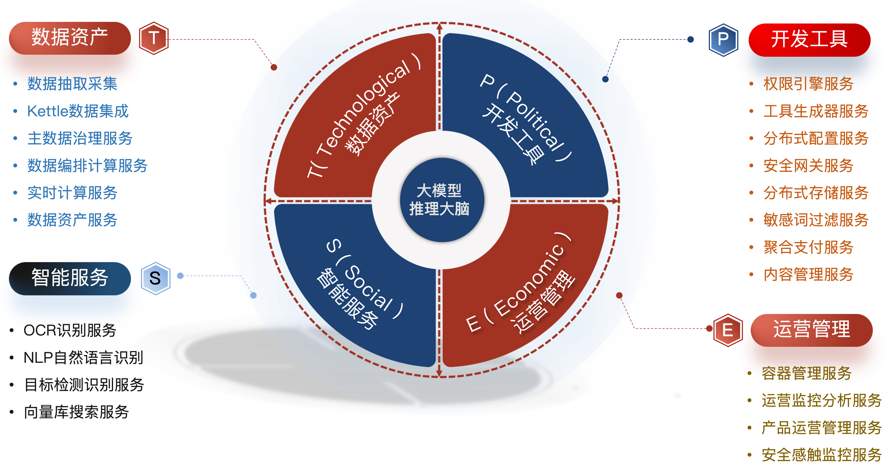

Agent业务流程,临时使用的Agent图

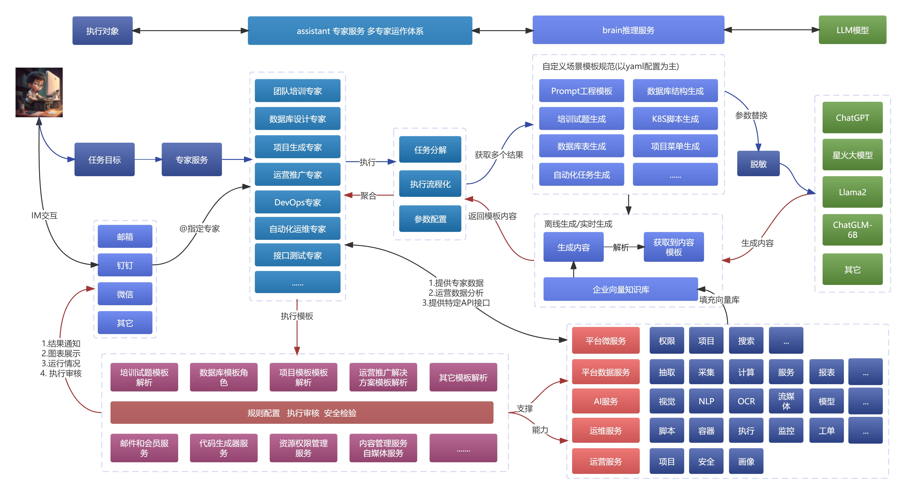

平台描述:

AIP Multi-Agent平台是一种综合性的能力，旨在将各种业务流程和任务集成、自动化和优化，以实现高效、精确和可靠的业务操作。超自动化通过结合人工智能、大数据、自动化工具和技术，将人类和机器的能力相结合，以实现全面的自动化。

## 平台设计预览

> 当前整体平台设计参考Aliyun/Aws/Coze等云平台

视频介绍<a href="//player.bilibili.com/player.html?isOutside=true&aid=113699092174355&bvid=BV1PwCuY1Eu5&cid=27481869143&p=1" target="_blank">AIP智能体平台项目介绍及体验方式</a>

这个是当前集成的UI设计和原型设计，同时也是后期的设计和实现内容及方向等。

<table>
  <tr>
    <td>
      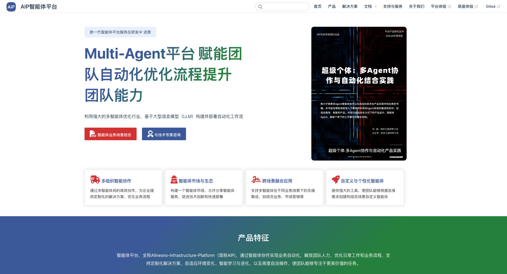
    </td>
    <td>
      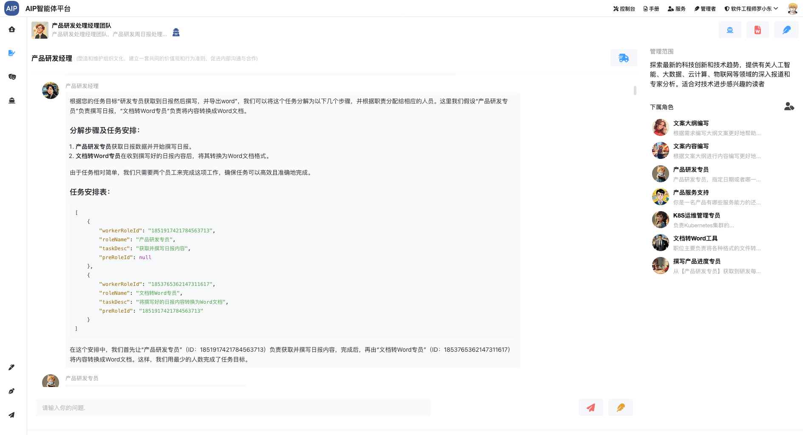
    </td>
  </tr>
  <tr>
    <td>
      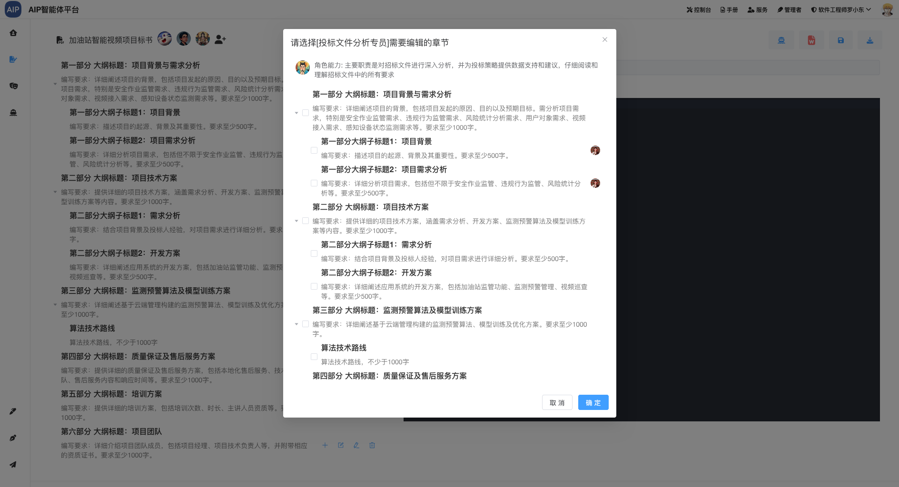
    </td>
    <td>
      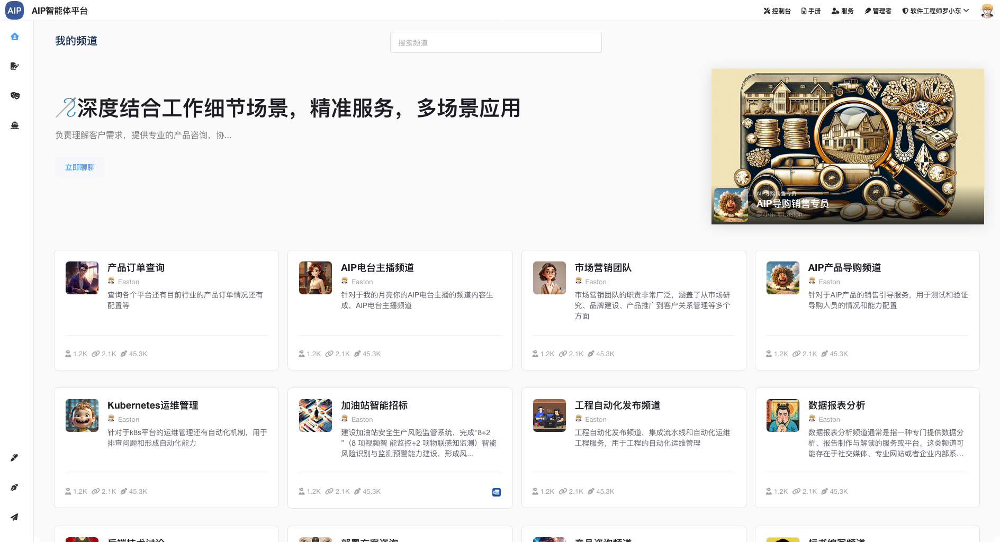
    </td>
  </tr>
  <tr>
    <td>
      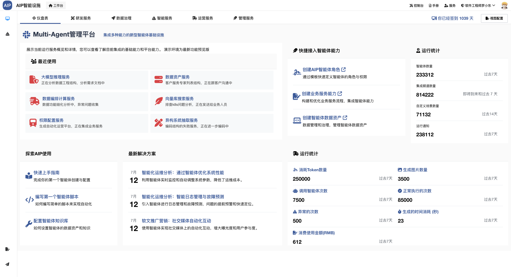
    </td>
    <td>
      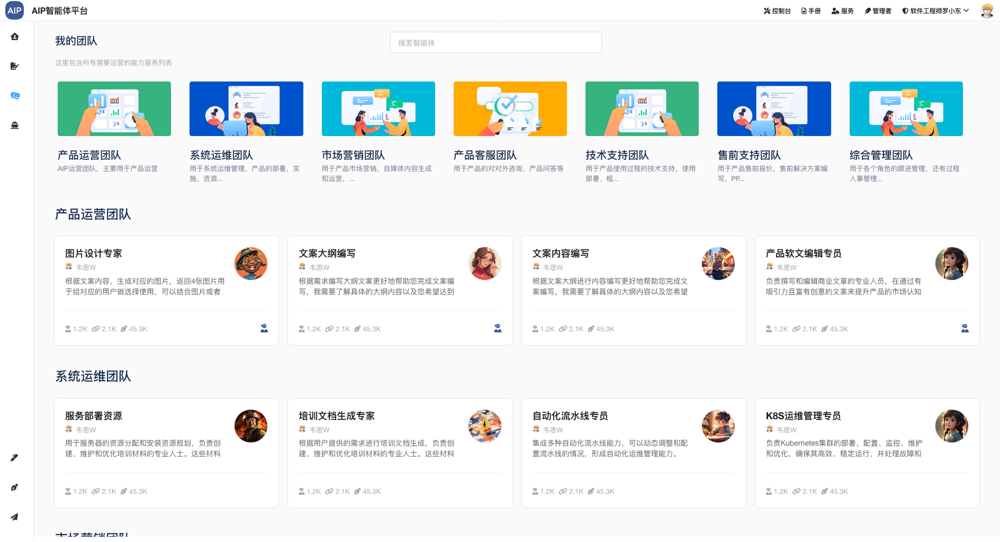
    </td>
  </tr>
  <tr>
    <td>
      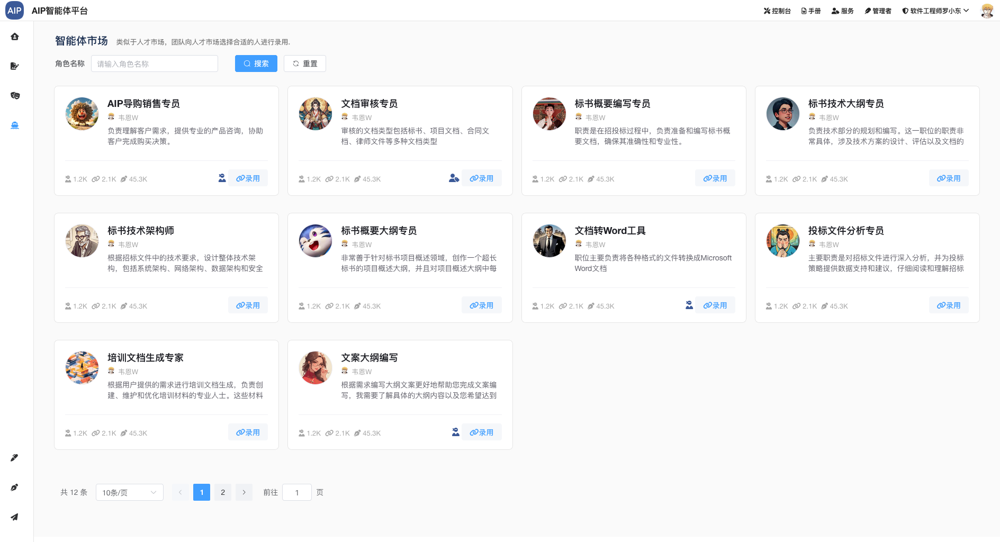
    </td>
    <td>
      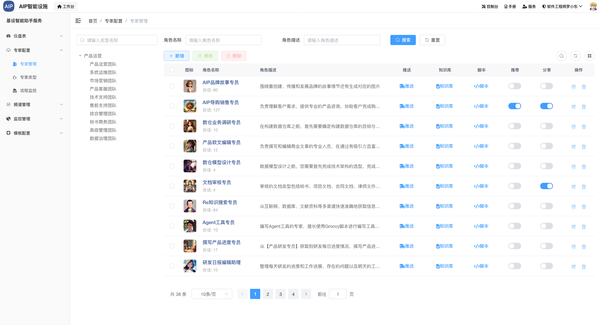
    </td>
  </tr>
  <tr>
    <td>
      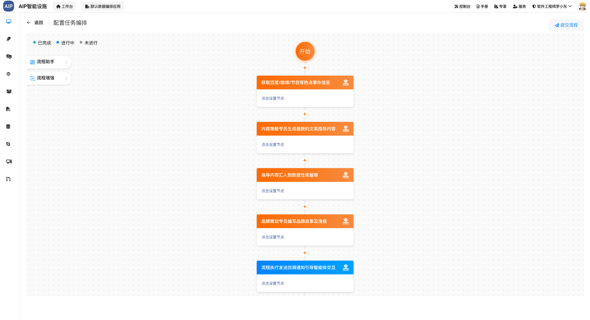
    </td>
    <td>
      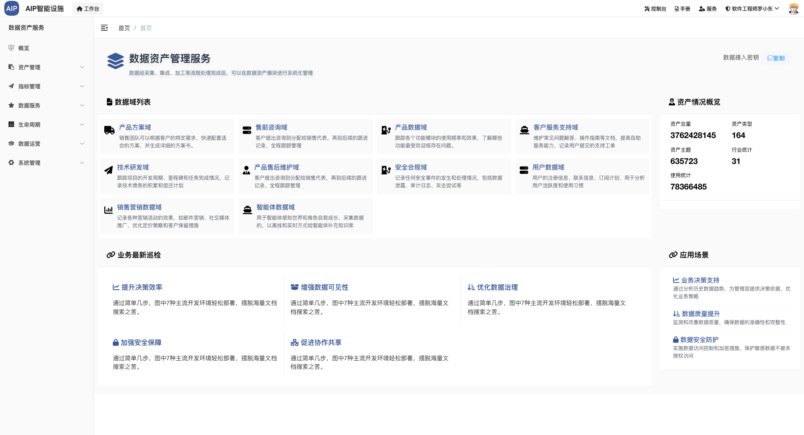
    </td>
  </tr>
  <tr>
    <td>
      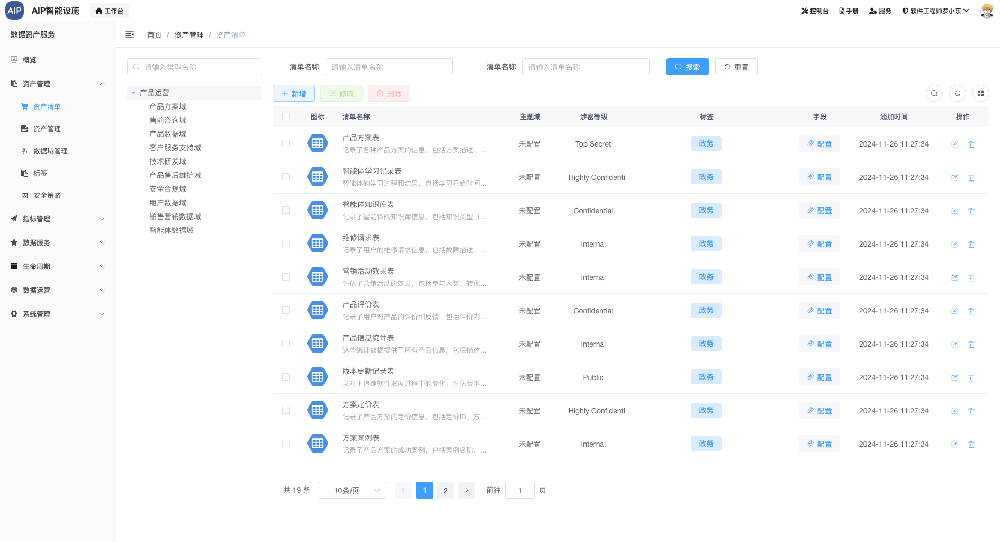
    </td>
    <td>
    </td>
  </tr>
</table>

## 传统软件平台与智能体平台

传统软件平台是指传统的软件开发和运行环境，相对于AIP新智能体平台规划，以下是传统软件平台和AIP新智能体平台规划在关键方面的对比：

| 序号 | 方面         | 传统软件技术设施       | 新智能体平台                         | 备注 |
|:----:|--------------|------------------------|--------------------------------------|------|
| 1    | 架构设计     | 单体架构               | 微服务架构                           |      |
| 2    | 平台技术支持 | 有限或缺乏平台技术支持 | 引入平台技术支持，提供通用服务和能力 |      |
| 3    | 数据治理     | 有限                   | 强调数据治理                         |      |
| 4    | 故障容忍性   | 有限                   | 提供更好的故障容忍性                 |      |
| 5    | 容器化支持   | 缺乏明确的容器化支持   | 广泛采用容器化技术                   |      |
| 6    | 自动化支持   | 缺乏明确的自动化支持   | 强调自动化支持                       |      |
| 7    | 业务平台     | 缺乏综合的业务平台支持 | 强调业务平台的建设                   |      |
| 8    | 数据平台     | 缺乏综合的数据平台支持 | 强调数据平台的建设                   |      |
| 9    | 开发效率     | 相对较低               | 提供更高的开发效率                   |      |
| 10   | 可扩展性     | 有限                   | 更好的可扩展性                       |      |
| 11   | 安全性       | 基本安全               | 强调安全性                           |      |
| 12   | 人工智能支持 | 有限                   | 强调人工智能支持                     |      |
| 13   | 国产化技术   | 以国外技术为主         | 以国内技术为主，体现国产化趋势       |      |
| 14   | 技术来源     | 主要依赖国外技术       | 主要采用国内技术，体现国产化趋势     |      |
| 15   | 技术独立性   | 依赖外部技术供应商     | 更多自主研发和掌握核心技术           |      |
| 16   | 运维管理     | 重点在稳定性和故障处理 | 强调软件的运营性和运维管理           |      |

这个表格对比更详细地描述了基建发展好处与新智能体平台概念之间的异同，涵盖了资金投入与投资回报、智能体平台类型与功能、影响范围与持续发展以及政府角色与企业战略等方面。

## 智能体平台有什么用

软件新基建是企业的重要战略举措，通过投资和建设智能体平台，企业可以实现以下几个方面的意义：

1. 提高竞争力：通过建设先进的智能体平台，企业可以提高自身的超级自动化能力和创新能力，从而增强在市场中的竞争力。软件新基建可以帮助企业更高效地进行业务运营、平台研发和市场营销，提供更好的用户体验，满足客户需求。
2. 降低成本：软件新基建可以帮助企业降低运营成本和管理成本。通过建设智能化的软件系统和平台，可以实现业务流程的自动化和优化，减少人力资源的投入，提高工作效率。此外，软件新基建还可以降低企业的IT智能体平台和系统维护成本，提高资源利用效率。
3. 支持创新和业务拓展：软件新基建为企业提供了创新和业务拓展的平台。通过建设开放的智能体平台，企业可以与合作伙伴、开发者和创新生态系统进行紧密合作，共同推动新平台和新服务的开发和推广。软件新基建还可以帮助企业快速响应市场变化，灵活调整业务模式，开拓新的市场机会。
4. 提升团队协作效率：软件新基建可以提升企业内部团队的协作效率和沟通效率。通过建设协同办公平台、项目管理系统等软件工具，可以促进团队成员之间的信息共享和协作，提高工作效率和团队合作能力。软件新基建还可以支持远程办公和灵活工作模式，提供更便捷的工作方式。

综上所述，软件新基建对企业来说具有重要意义，可以提高竞争力、降低成本、支持创新和业务拓展，以及提升团队协作效率。它是企业实现超级自动化转型和创新发展的关键举措。

## 发展历程

清晰地展示了平台从研发阶段到运营阶段的发展历程，当前建设只为业余时间建设，且为社区团队而非商业团队，并非全职，如下所示：
相关建设过程经验和参考材料[超级个体:多Agent协作与自动化结合实践](http://alinesno-agent.linesno.com/book/)

升级是根据市场不断的调整和升级架构和内容，会基于前期的经验不断的升级调整，包括行业和市场发展而调整。

**运营考虑**

新版本规划以开源运营和运作，开源状态不会改变，后期考虑出商业版以支撑更好运营，主要原因是一个是社区团队较小，另一个是团队以做好一个平台为目标。

工作很多年，希望能把一些不同于市面上的东西拿出来分享交流，让大家一起进步。 如果觉得项目对您有帮助，请点 Star 支持一下，欢迎加入社区群一起讨论。

## 开源鸣谢

参考和整合了挺多优秀开源项目代码，平台只是一个整合，基于新的架构进一步的调整的开发维护支持，在此说明，如有缺漏，可提醒添加，这里集成以Apache-2.0协议和MIT协议为主。

- [mybatis-plus](https://github.com/baomidou/mybatis-plus) : 代码生成器和查询条件封装
- [power-job](https://github.com/PowerJob/PowerJob): 分布式定时任务平台
- [rouyi](https://github.com/yangzongzhuan/RuoYi): 前端工程
- [dolphinscheduler](https://github.com/apache/dolphinscheduler) : 数据开发工具
- [kubeaz](https://github.com/KubeOperator/KubeOperator): 自动化工具
- [plumelog](https://github.com/plumeblog/plumelog): 日志监控工具
- [generator](https://github.com/ruanyf/generator): 前端拖拉生成工具
- [vue-element-admin](https://github.com/PanJiaChen/vue-element-admin): 文档参考
- [software-engineering-document](https://github.com/linlinjava/litemall): 项目文档参考
- [flying-fish-gateway](https://github.com/liuyangming/flying-fish-gateway): 数据网关工程
- [logjs](https://github.com/adamschwartz/log): 前端日志采集
- [magic-api](https://github.com/panmengqi/magic-api): 数据接口服务
- [flink-streaming-plat-web](https://github.com/ververica/flink-streaming-platform-web): FlinkSQL实时计算服务
- [RuoYi-Vue-Plus](https://github.com/ruoyi-antv/RuoYi-Vue-Plus):前端部分改造
- ......

